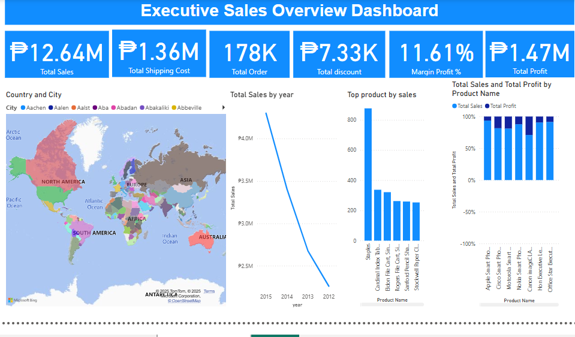

# 📊 Executive Sales Overview Dashboard (Power BI)

This project features an interactive Power BI dashboard that provides a comprehensive overview of executive-level sales performance metrics. It visualizes key sales KPIs, trends, and insights to support decision-making for sales leaders.

## 🔍 Dashboard Highlights

- **Total Sales:** ₱12.64M  
- **Total Shipping Cost:** ₱1.36M  
- **Total Orders:** 178K  
- **Total Discount Given:** ₱7.33K  
- **Margin Profit %:** 11.61%  
- **Total Profit:** ₱1.47M

---

## 📌 Key Visualizations

- **🌍 Sales by Country and City:**  
  Interactive map highlighting regional sales distribution for global coverage.

- **📈 Sales Trends by Year:**  
  A line graph showing how total sales changed over the years.

- **🏆 Top Products by Sales:**  
  A bar chart displaying the most profitable and high-performing products.

- **📊 Total Sales vs. Total Profit by Product Name:**  
  Comparative bar chart showing each product’s contribution to revenue and profit.

---

## 🧰 Tools Used

- **Power BI** – For building interactive visual dashboards  
- **Excel / CSV Dataset** – Data preparation and cleansing  
- **DAX** – For calculated metrics such as profit margin

---

## 💡 Insights

- Top sales are concentrated in a few key products (e.g., Staples).
- Sales have shown a decreasing trend from 2012 to 2015.
- Margin profit percentage is relatively low at 11.61%, indicating room for optimization.
- Sales performance varies significantly by region and product.

---

## 🚀 How to Use

1. Download the Power BI `.pbix` file (if available).
2. Open it in Power BI Desktop.
3. Interact with filters and visuals to explore insights.

---

